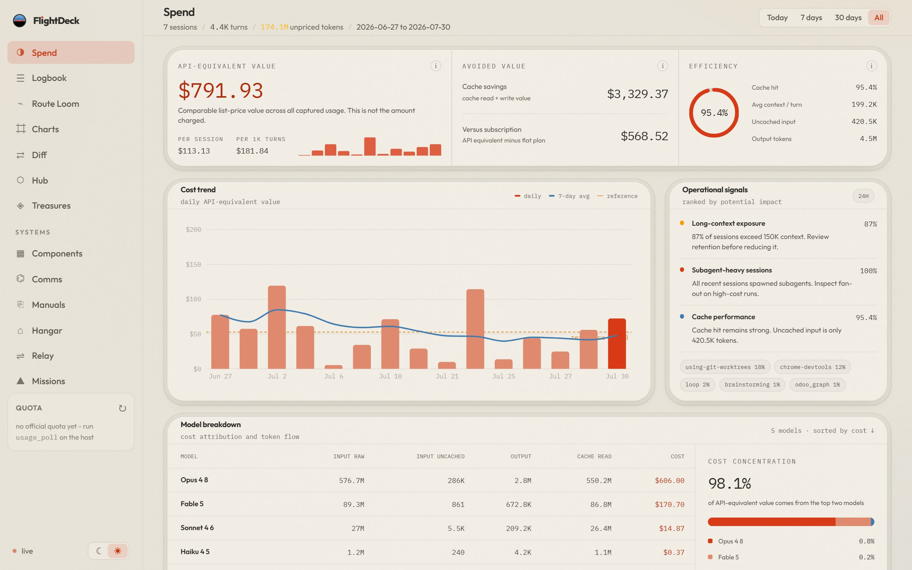
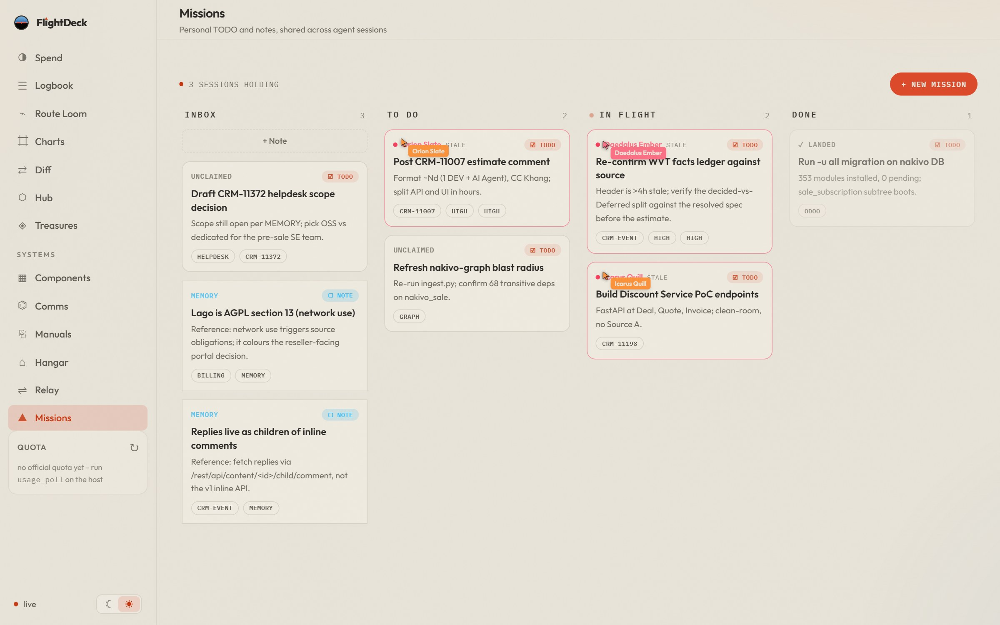
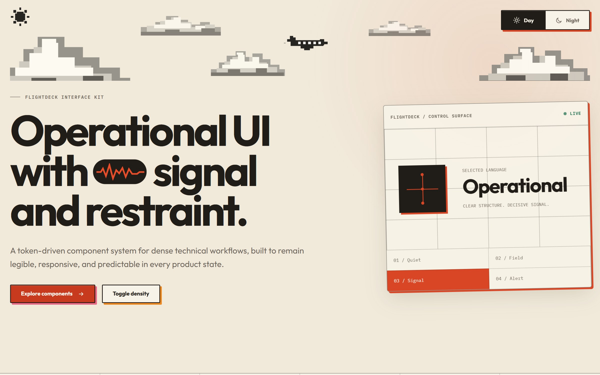

<div align="center">

# FlightDeck

**Local-first mission control for Claude Code.**

Spend analytics · session logbook · missions board for agents · environment systems — all from the transcripts already on your machine, and nothing leaves it.

[Quick start](#-quick-start) ·
[The deck](#-the-deck) ·
[Architecture](#%EF%B8%8F-architecture) ·
[Configuration](#%EF%B8%8F-configuration) ·
[Design system](#-design-system)


</div>

---

Claude Code writes a full transcript of every session to `~/.claude/projects`.
FlightDeck ingests those files into a local SQLite cache and turns them into an
operational deck: what your usage is worth at API list prices, what every
session did turn by turn, which missions your agents are flying right now, and
whether the environment around them (MCP servers, skills, containers) is
healthy.



## 🚀 Quick start

Requirements: Python 3.12+, Node.js 20+.

**Windows** (PowerShell):

```powershell
.\demo.ps1                # first run: creates .venv, installs deps, starts both services
.\demo.ps1 -SkipInstall   # later runs
```

**Linux**:

```bash
./demo.sh
```

Both start:

| Service | URL |
| --- | --- |
| Frontend | http://127.0.0.1:5190 |
| Backend API | http://127.0.0.1:8010 |

`Ctrl+C` in the runner terminal stops both. The backend reads Claude Code data
from `~/.claude/projects` and keeps its cache in `backend/audit.local.db`.

<details>
<summary>Persistent Linux host install (systemd)</summary>

The `Makefile` drives a host install with a built frontend and a systemd unit:

```bash
make venv build     # .venv + frontend/dist
make serve          # run in the foreground
make service enable # install and start the systemd service
```

See [docs/host-stack-migration.md](docs/host-stack-migration.md).

</details>

## 🧭 The deck

| View | What it answers |
| --- | --- |
| **Spend** | What is my usage worth at API list prices, what did caching save, which models drive cost |
| **Logbook** | Every session with turns, tokens, cache ratio — each opens as a deep-linkable live transcript |
| **Route Loom** | One session as routes: each instruction traced through role units, from input to summary |
| **Charts** | Dependency-graph impact views (needs a graph file, see configuration) |
| **Diff** | Compare refs across the repos in your workspace |
| **Hub** | Saved integration flows (HTTP, Odoo XML-RPC, …) with stored credentials |
| **Treasures** | Artifact library — wrap, preview, provenance, linked back to sessions |
| **Components** | The FlightDeck interface kit, live |
| **Comms / Manuals / Hangar** | MCP servers, installed skills, Docker containers — read-only systems views |
| **Relay** | AG-UI live stream of agent runs |
| **Missions** | Personal kanban shared with agent sessions over MCP |

Costs are API list-equivalent — comparable value, not the amount charged.
Sessions ingest continuously (watcher) or on demand (`POST /api/reingest`).

### Missions: a kanban your agents can fly

Agents claim, work, and land missions through the bundled MCP server while the
board updates live — each hold shows which session is flying the card.



Run the FastMCP server from `backend/` (it shares the web UI's store):

```bash
../.venv/bin/python -m flightdeck.mcp_server
```

Tools: `missions_list`, `mission_get`, `mission_create`, `mission_update`,
`mission_claim`, `mission_claim_as`, `mission_release`, `mission_land`.
Contract and state machine: [MISSIONS_MVP_CONTRACT.md](MISSIONS_MVP_CONTRACT.md).

## 🏗️ Architecture

```
~/.claude/projects (transcripts)          ~/.claude/jobs, roster
        │  watch / reingest                        │
        ▼                                          ▼
backend/flightdeck  ── FastAPI, single process ── SQLite (WAL) or PostgreSQL
  routers: core sessions missions charts diff hub stream systems agui
  SSE /api/stream pushes updates; snapshot cache serves warm reads
        ▲                                          ▲
        │ /api (vite proxy)                        │ same store
frontend/ ── React 18 + Vite ──────────────  flightdeck.mcp_server (FastMCP)
  entries: index.html · component-lab.html · home-concept.html · home-concept-v2.html
```

- **Backend** — FastAPI on uvicorn, one process by design. Ingest parses
  transcript JSONL into SQLite (PostgreSQL when `TOKEN_AUDIT_DATABASE_URL` is
  set); metrics are served from a snapshot cache invalidated by the watcher.
  Quota merges `claude /usage` polls with statusline captures.
- **Frontend** — React 18 + Vite, hash routing for deep links, SSE for live
  updates, Recharts/React Flow/force-graph for the instrument views.
- **MCP server** — FastMCP process sharing the missions store, so a
  `mission_claim` from an agent appears on the kanban within its 2 s poll.

## ⚙️ Configuration

`backend/config.toml` plus environment overrides (env wins):

| Variable | Meaning | Default |
| --- | --- | --- |
| `TOKEN_AUDIT_CONFIG` | Path to config.toml | `backend/config.toml` |
| `TOKEN_AUDIT_PROJECTS_DIR` | Claude Code transcripts dir | `~/.claude/projects` |
| `TOKEN_AUDIT_DB_PATH` | SQLite cache path | `audit.db` |
| `TOKEN_AUDIT_DATABASE_URL` | Use PostgreSQL instead of SQLite | unset |
| `TOKEN_AUDIT_SUBSCRIPTION_USD` | Flat-plan price for the “versus subscription” card | `0` |
| `TOKEN_AUDIT_WATCH` | `1` = watch transcripts and ingest live | `1` in demo |
| `TOKEN_AUDIT_REINGEST_INTERVAL` | Periodic full-sweep seconds | `120` in demo |
| `TOKEN_AUDIT_FLOWS_DIR` | Hub flow files | `backend/flows` |
| `TOKEN_AUDIT_GRAPH_FILE` | Dependency graph JSON for Charts | unset |
| `FLIGHTDECK_WORKSPACE` | Workspace root for the Diff tool | repo parent |

## 🎨 Design system

FlightDeck ships its own visual contract — warm paper, charcoal ink, one coral
signal, and a three-layer face/frame/depth grammar for every tactile control.
The contract lives in [DESIGN.md](DESIGN.md), the 18-component reference
implementation in
[frontend/src/ui/FlightComponents.jsx](frontend/src/ui/FlightComponents.jsx)
(documented in
[docs/flightdeck-component-system.md](docs/flightdeck-component-system.md)),
and everything is showcased live at `/component-lab.html`:



Home-layout explorations ship as separate Vite entries: `/home-concept.html`
(Local Workbench) and `/home-concept-v2.html` (Briefing board).

## 🗂️ Repository layout

```
backend/        FastAPI app (flightdeck package), config.toml, requirements
frontend/       React + Vite app and the standalone concept/lab entries
warp-fleet/     experimental: drive Warp terminal panes from an orchestrator
docs/           design docs, component system, screenshots (+ capture script)
docker/ deploy/ container and deployment assets
demo.ps1/.sh    one-command local run (both services)
Makefile        Linux host runner (venv, build, systemd service)
```

## 🛠️ Development

```bash
npm --prefix frontend run dev     # frontend on :5190 (proxies /api to :8010)
npm --prefix frontend run build   # production bundle into frontend/dist
npm --prefix frontend test        # vitest (component contract tests)
```

The backend runs alone from `backend/` with
`../.venv/Scripts/python -m uvicorn flightdeck.server:app --port 8010`
(`bin` instead of `Scripts` on Linux).

README screenshots are generated against live local data with
[docs/screenshots/capture.mjs](docs/screenshots/capture.mjs) — FlightDeck
running, then `node docs/screenshots/capture.mjs` (drives the installed Edge
via Playwright, no browser download).
